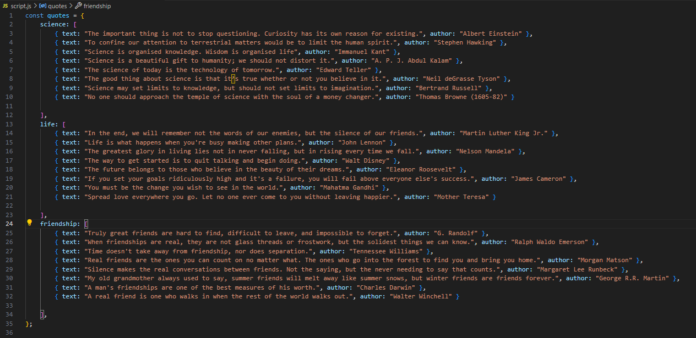

# Quote Generator App - Intership task (Chulo Solution)

#### Application Createria

1. Create a simple quote generator app using only HTML, CSS and JavaScript.
2. Displaying one quote at a time to the user.
3. Add a dropdown button or radio button to toggle between categories.
4. Implement "Next" and "Previous" buttons that allow users to navigate through the quotes in sequential order.
5. Implement a "Random" button that shows random quotes from the selected categories.
6. Add a switch to toggle between dark and light mode for the app's interface.
7. Provide functionality to increase and decrease the font size of the displayed quotes.
8. Design the app that is mobile friendly.
9. The app should be built using only HTML, CSS, and JavaScript without the use of any external frameworks.
10. Backend services and databases should not be used for this project.
11. Host the app on Netlify and make the source code available on a GitHub repository.

#### Javascript Ojbect
I created javascript object as "quotes" which is the main object containing all the quotes and that is collection of quotes into categories has three properties: science, life and friendship. Each of these properties holds an array of quote objects.

Each category contains an array of quote objects, where each object has a text (the quote) and an author (the person who said it).